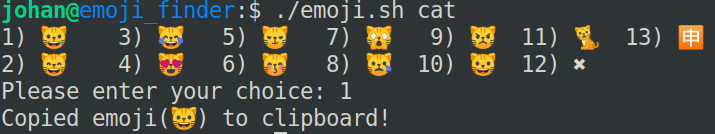

## **What is it?**
It's a bash script which searches a file with emojis with a user supplied argument and gives a prompt of matches. The user can then select a match and it will be copied to the clipboard

### **Dependencies**
* xclip

### **Usage**
